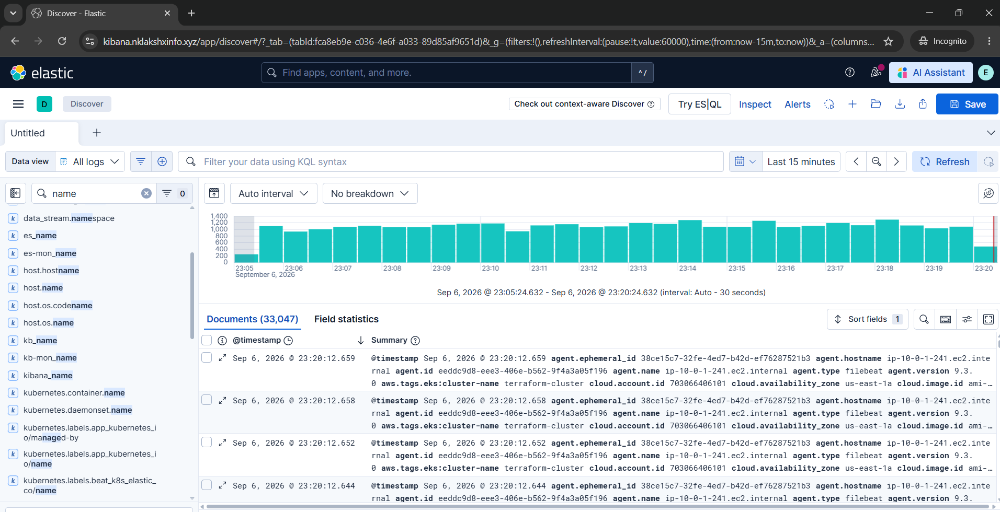
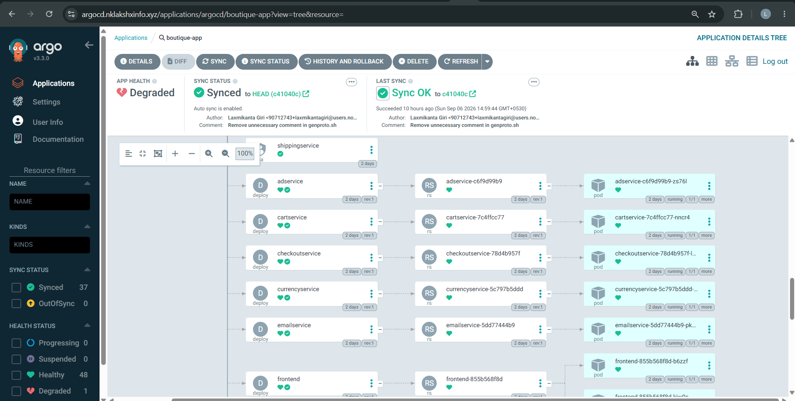
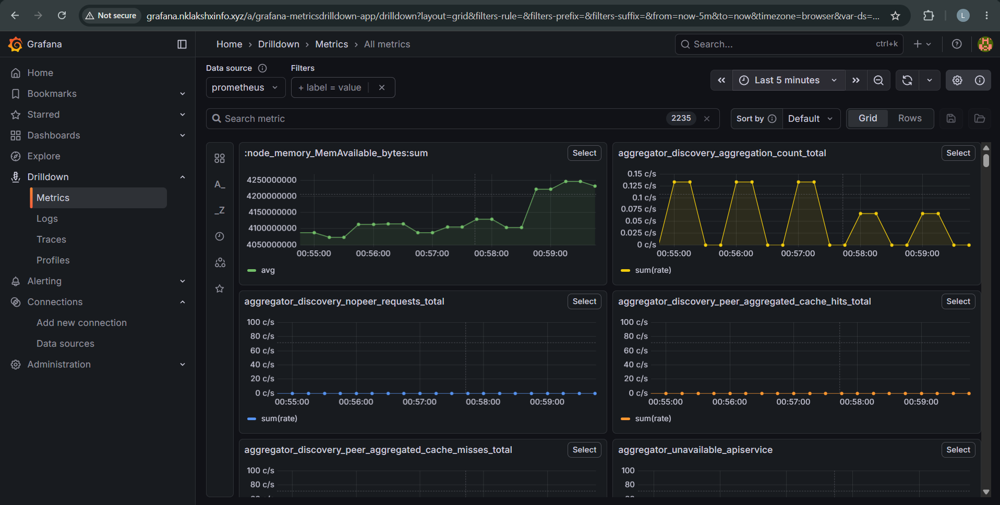
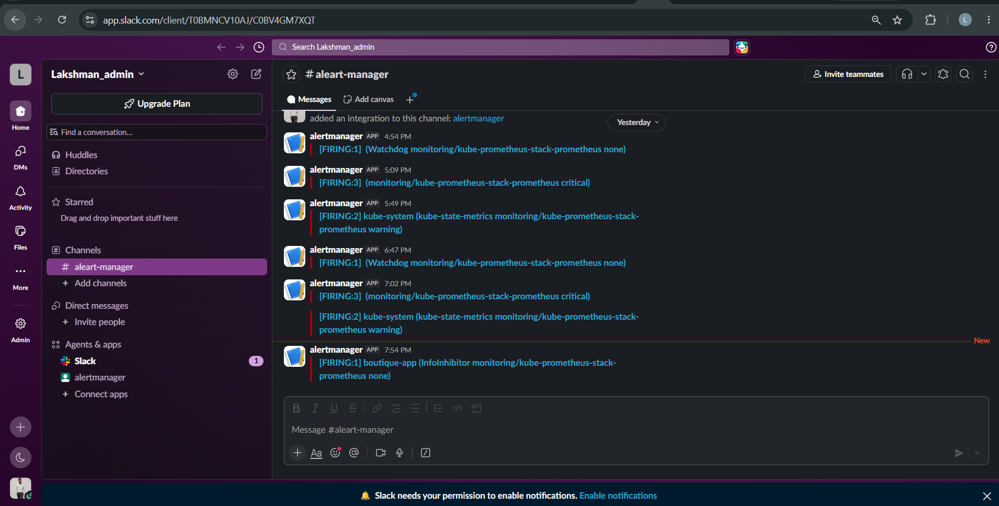

Comparing your written `README.md` text with the actual GitHub repository screenshots reveals **3 critical mismatches** that need immediate alignment:

1. **Repository Structure Mismatch:** Your `README.md` tree omits several top-level directories present in the repo: `docs/`, `external-dns/`, `helm-chart/`, `istio-manifests/`, `kustomize/`, `microservices-extra-kube-manifests/`, `protos/`, `release/`, and `build-and-push.sh`.
2. **Generic Clone URL:** The Git clone step contains a placeholder (`<your-username>`). It should point directly to your repository: `[https://github.com/laksh1001/Production-Grade_GitOps-Driven_Microservices-Application.git](https://github.com/laksh1001/Production-Grade_GitOps-Driven_Microservices-Application.git)`.
3. **Unreferenced Visual Proof:** Your repository root contains screenshot assets (`1.png` through `12.png`), but your `README.md` does not render them. Embedding these directly under key sections transforms the README from generic documentation into visual proof of work.

---

### Corrected & Production-Ready `README.md`

Replace your current `README.md` with the updated markdown below:

```markdown
# Production-Grade GitOps-Driven Microservices & Observability Platform

An enterprise-ready cloud-native microservices platform built on Amazon EKS, featuring automated GitOps delivery pipelines, unified ingress routing using the Kubernetes Gateway API, and an end-to-end full-stack observability suite (Prometheus, Alertmanager, Grafana, Slack alerting, and ECK/Elasticsearch/Kibana/Filebeat log streaming).

---

## Architecture Overview


```

```
                  +---------------------------------------+
                  |         AWS Application Gateway       |
                  |          (AWS Gateway API / ALB)      |
                  +-------------------+-------------------+
                                      |
    +------------------+--------------+-------------+------------------+
    |                  |                            |                  |
    v                  v                            v                  v

```

+---------------+  +---------------+            +---------------+  +---------------+
|  shop.*       |  |  argocd.*     |            |  kibana.*     |  |  grafana.*    |
| (Boutique App)|  | (ArgoCD Server|            | (Kibana UI)   |  | (Grafana UI)  |
+-------+-------+  +-------+-------+            +-------+-------+  +-------+-------+
|                  |                            |                  |
|                  |                            |                  v
|                  |                            |          +---------------+
|                  |                            |          |  Prometheus   |
|                  |                            |          |  (Metrics API)|
|                  |                            |          +-------+-------+
|                  |                            |                  |
|                  |                            v                  v
|                  |                    +---------------+  +---------------+
|                  |                    | Elasticsearch |  | Alertmanager  |
|                  |                    | (ECK Cluster) |  |    (Slack)    |
|                  |                    +-------^-------+  +---------------+
|                  |                            |
|                  |                    +-------+-------+
|                  |                    |   Filebeat    |
|                  |                    |  (DaemonSet)  |
|                  |                    +---------------+
v                  v
+----------------------------------------------------------------------------------+
|                               Amazon EKS Cluster                                 |
|   [boutique-app]               [argocd]                  [logging] / [monitoring]|
+----------------------------------------------------------------------------------+

```

---

## Architecture & Dashboards Verification

| Dashboard / Pipeline | Verification Preview |
| :--- | :--- |
| **Kibana Log Discovery (ECK)** |  |
| **ArgoCD GitOps Sync Tree** |  |
| **Grafana Observability Metrics** |  |
| **Slack Incident Alerting** |  |

---

## Core Technologies

* **Cloud Infrastructure:** AWS EKS, AWS VPC, AWS Application Load Balancer (ALB), IAM, EBS CSI Driver
* **Infrastructure as Code:** Terraform
* **Application Framework:** Google Online Boutique (11 Polyglot Microservices)
* **Continuous Integration:** GitHub Actions (Automated image build & push to container registries)
* **Continuous Delivery (GitOps):** ArgoCD
* **Ingress & Traffic Management:** AWS Gateway API Controller, Kubernetes HTTPRoute, ExternalDNS
* **Service Mesh & Config:** Istio, Kustomize, Helm Charts
* **Metrics & Autoscaling:** Prometheus, Alertmanager, Grafana, Metrics Server, Horizontal Pod Autoscaler (HPA)
* **Logging Pipeline:** Elastic Cloud on Kubernetes (ECK), Elasticsearch 9.x, Kibana, Filebeat DaemonSet
* **Alerting Integrations:** Alertmanager to Slack Webhook Notifications

---

## Repository Structure


```

├── .github/
│   └── workflows/
│       ├── ci-trigger.yaml                     # Trigger workflow for service updates
│       └── microservices-ci.yaml             # Multi-service build & push pipeline
├── argocd/
│   └── application.yaml                      # ArgoCD Application definition for Boutique App
├── docs/                                     # Implementation guides and screenshots
├── external-dns/                             # Route 53 ExternalDNS manifests
├── gateway-api-manifests/
│   ├── alb-gateway.yaml                      # AWS Gateway API definition
│   └── http-routes.yaml                      # HTTPRoutes for shop, argocd, kibana, grafana
├── helm-chart/                               # Helm charts for microservices deployment
├── istio-manifests/                          # Istio ServiceEntry and Gateway configs
├── kubernetes-manifests/                     # Raw Kubernetes deployment manifests
├── kustomize/                                # Kustomize overlays and base manifests
├── microservices-extra-kube-manifests/       # Additional cluster routing manifests
├── observability/
│   ├── eck/
│   │   ├── elasticsearch.yaml                # ECK Elasticsearch cluster CRD
│   │   ├── kibana.yaml                       # ECK Kibana CRD
│   │   └── filebeat.yaml                     # Filebeat DaemonSet configuration
│   └── monitoring/
│       ├── prometheus-values.yaml            # Helm values for kube-prometheus-stack
│       └── alertmanager-slack.yaml           # Alertmanager Slack webhook configuration
├── protos/                                   # gRPC protobuf definitions for Go/Java services
├── release/                                  # Application release versioning manifests
├── scaling/
│   └── frontend-hpa.yaml                     # Horizontal Pod Autoscaler for frontend service
├── src/                                      # Microservices source code (C#, Go, Java, Node.js, Python)
├── terraform/                                # Infrastructure as Code
│   ├── main.tf
│   ├── variables.tf
│   ├── vpc.tf
│   ├── eks.tf
│   └── outputs.tf
├── build-and-push.sh                         # Helper script for container builds
├── kustomization.yaml                        # Top-level Kustomize configuration
└── README.md

```

---

## Step-by-Step Deployment Guide

### Phase 1: Infrastructure Provisioning (Terraform)

1. **Clone the repository:**
```bash
git clone [https://github.com/laksh1001/Production-Grade_GitOps-Driven_Microservices-Application.git](https://github.com/laksh1001/Production-Grade_GitOps-Driven_Microservices-Application.git)
cd Production-Grade_GitOps-Driven_Microservices-Application/terraform

```

2. **Initialize and apply Terraform configurations:**

```bash
terraform init
terraform plan -out=tfplan
terraform apply tfplan

```

3. **Configure `kubectl` context for the newly created EKS cluster:**

```bash
aws eks update-kubeconfig --region us-east-1 --name terraform-cluster

```

---

### Phase 2: Core Controllers Installation

1. **Deploy the AWS Load Balancer Controller:**

```bash
helm repo add eks [https://aws.github.io/eks-charts](https://aws.github.io/eks-charts)
helm repo update

helm install aws-load-balancer-controller eks/aws-load-balancer-controller \
  -n kube-system \
  --set clusterName=terraform-cluster \
  --set serviceAccount.create=true \
  --set enableGatewayAPI=true

```

2. **Deploy Metrics Server for Resource Utilization & HPA:**

```bash
helm repo add metrics-server [https://kubernetes-sigs.github.io/metrics-server/](https://kubernetes-sigs.github.io/metrics-server/)
helm repo update

helm install metrics-server metrics-server/metrics-server \
  -n kube-system \
  --set args={--kubelet-insecure-tls}

```

---

### Phase 3: GitOps Setup with ArgoCD

1. **Deploy ArgoCD:**

```bash
kubectl create namespace argocd
kubectl apply -n argocd -f [https://raw.githubusercontent.com/argoproj/argo-cd/stable/manifests/install.yaml](https://raw.githubusercontent.com/argoproj/argo-cd/stable/manifests/install.yaml)

```

2. **Apply the Boutique Application GitOps Sync Definition:**

```bash
kubectl apply -f argocd/application.yaml

```

---

### Phase 4: Observability Pipeline Deployment

#### 1. ECK Logging Stack (Elasticsearch, Kibana, Filebeat)

1. **Install ECK Operator:**

```bash
helm repo add elastic [https://helm.elastic.co](https://helm.elastic.co)
helm repo update

helm install eck-operator elastic/eck-operator -n logging --create-namespace

```

2. **Deploy Elasticsearch and Kibana CRDs:**

```bash
kubectl apply -f observability/eck/elasticsearch.yaml -n logging
kubectl apply -f observability/eck/kibana.yaml -n logging

```

3. **Deploy Filebeat DaemonSet to Stream Cluster Logs:**

```bash
kubectl apply -f observability/eck/filebeat.yaml -n logging

```

#### 2. Prometheus, Alertmanager, and Grafana Stack

1. **Deploy `kube-prometheus-stack` via Helm:**

```bash
helm repo add prometheus-community [https://prometheus-community.github.io/helm-charts](https://prometheus-community.github.io/helm-charts)
helm repo update

helm install kube-prometheus-stack prometheus-community/kube-prometheus-stack \
  -n monitoring \
  --create-namespace \
  -f observability/monitoring/prometheus-values.yaml

```

2. **Configure Alertmanager with Slack Webhook:**

```bash
kubectl apply -f observability/monitoring/alertmanager-slack.yaml -n monitoring

```

3. **Set Grafana Service to NodePort (Required for Gateway API Instance Targets):**

```bash
kubectl patch svc kube-prometheus-stack-grafana -n monitoring -p '{"spec": {"type": "NodePort"}}'

```

---

### Phase 5: Routing & Ingress Configuration (AWS Gateway API)

1. **Deploy the ALB Gateway:**

```bash
kubectl apply -f gateway-api-manifests/alb-gateway.yaml

```

2. **Deploy HTTPRoutes for All Domain Endpoints:**

```bash
kubectl apply -f gateway-api-manifests/http-routes.yaml

```

---

### Phase 6: DNS Configuration & Access

Map the ALB public endpoint or IP address to your domain endpoints in Route 53 or your DNS manager:

* `shop.nklakshxinfo.xyz` -> Online Boutique Application
* `argocd.nklakshxinfo.xyz` -> ArgoCD Management Dashboard
* `kibana.nklakshxinfo.xyz` -> Kibana Log Discovery UI
* `grafana.nklakshxinfo.xyz` -> Grafana Monitoring Dashboards
* `prometheus.nklakshxinfo.xyz` -> Prometheus Targets and Metrics

---

## Autoscaling Verification

To test horizontal autoscaling on the microservices architecture:

1. **Apply the Horizontal Pod Autoscaler:**

```bash
kubectl apply -f scaling/frontend-hpa.yaml -n boutique-app

```

2. **Monitor Pod Scaling Activity:**

```bash
kubectl get hpa frontend-hpa -n boutique-app -w

```

---

## Infrastructure Teardown

To cleanly destroy all provisioned cloud resources:

```bash
# 1. Delete all in-cluster routing resources to trigger clean ALB deprovisioning
kubectl delete httproute -A --all
kubectl delete gateway -A --all

# 2. Release storage volumes
kubectl delete pvc -A --all

# 3. Destroy cloud infrastructure via Terraform
cd terraform
terraform destroy -auto-approve

```

```

```
